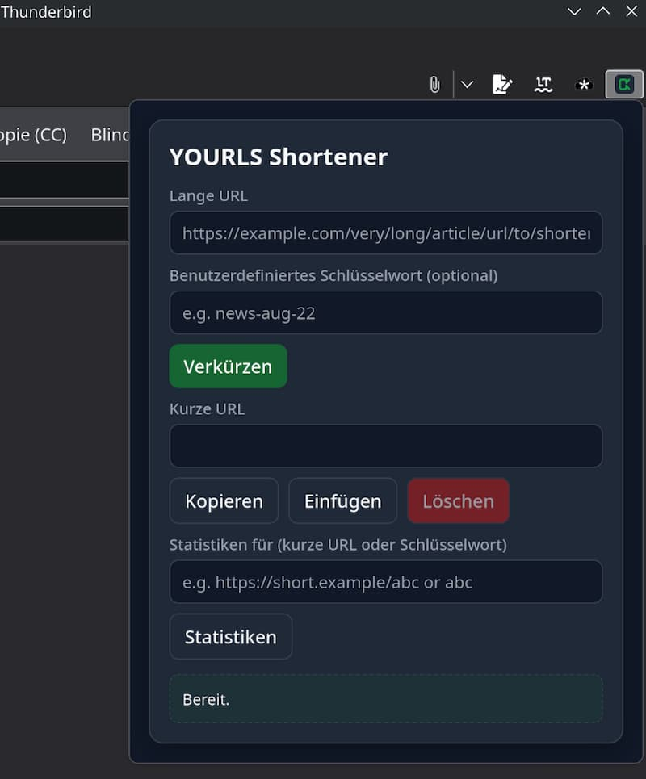

# kurl - YOURLS Shortener for Thunderbird

A Thunderbird add-on to shorten URLs with your self-hosted YOURLS instance and insert them directly into the email compose window.

## The Name `kurl`

The name **kurl** is a playful fusion of two words: **"k"** from the German word **"kurz,"** which means **short**, and **"url"**. In German, a short URL is often referred to as a **"Kurz-URL,"** making **kurl** a fitting and concise name for a URL shortener.

***

## Features

* **Quickly shorten links:** Create short URLs directly from the Thunderbird compose window.
* **Custom Keywords:** Assign optional custom keywords to your short links for easy memorization.
* **View Stats:** Check the click count and target URL for any existing short link.
* **Delete Links:** Manage your links by deleting short URLs directly from the add-on.
* **Auto-Copy:** Automatically copy the newly created short URL to your clipboard.
* **Multiple Workflows:** Use the toolbar button, right-click context menu, or a keyboard shortcut.
* **Multi-language Support:** Available in English, German, French, Spanish, and many more languages.

***

## About YOURLS (Your Own URL Shortener)

YOURLS is a free, open-source set of PHP scripts that allows you to run your own URL shortening service. Unlike commercial services like bit.ly, YOURLS gives you full control over your data, with powerful features like detailed statistics, link management, and a plugin architecture to extend its functionality.

This Thunderbird add-on requires you to have your own YOURLS instance already installed and running on a web server.

### How to Install YOURLS

Self-hosting YOURLS requires a web server with PHP and a MySQL database. The general steps are:
1.  Download the latest version of YOURLS from their official website.
2.  Unzip the files and upload them to your web server.
3.  Create a MySQL database and a user for it.
4.  Configure the `config.php` file with your database details, site URL, and a secure signature token.
5.  Run the installation script by navigating to `http://your-domain.com/admin/` in your browser.

For complete and detailed instructions, please refer to the official guide:
**[Official YOURLS Installation Guide](https://yourls.org/#Install)**

***

### Finding Your API Signature Token

To connect this add-on to your YOURLS instance, you need your unique API signature token.
1.  Log in to your YOURLS admin dashboard (e.g., `http://your-domain.com/admin/`).
2.  In the top menu, click on **Tools**.
3.  At the very top of the Tools page, you will find a section titled **"Secure passwordless API call"**. Your API signature token is the long string of characters displayed there.

***

## Installation of this Add-on

1.  Go to the [**Releases Page**](https://github.com/gerald-drissner/kurl-thunderbird-addon/releases).
2.  Download the `.zip` file from the latest release (e.g., `kurl-thunderbird-addon-v1.1.zip`).
3.  In Thunderbird, go to `Tools > Add-ons and Themes`.
4.  Click the gear icon (⚙️) and select "Install Add-on From File...".
5.  Select the downloaded `.zip` file.

***

## Usage

Before first use, you must configure the add-on by going to `Add-ons and Themes`, finding "kurl", and opening its preferences. You will need to enter your YOURLS instance URL and your API signature token.

There are three ways to use the shortener:

1.  **Toolbar Button:** Click the "kurl" icon in the compose window's toolbar to open the popup.
2.  **Context Menu:** Select a long URL in the editor, right-click, and choose "kurl: Shorten selection…".
3.  **Keyboard Shortcut:** Select a URL and press the keyboard shortcut to open the popup with the URL pre-filled.
    * The default shortcut is **`Ctrl+Shift+K`**.
    * You can change this shortcut in Thunderbird by going to `Tools > Add-ons and Themes`, clicking the gear icon (⚙️) next to "kurl", and selecting "Manage Extension Shortcuts".

***

## Privacy Policy

kurl communicates directly with the YOURLS instance URL that you configure in the add-on's settings. It does not collect, store, or transmit any other data to any other third-party servers.

***

## License

This project is licensed under the MIT License. See the [LICENSE](LICENSE) file for details.
